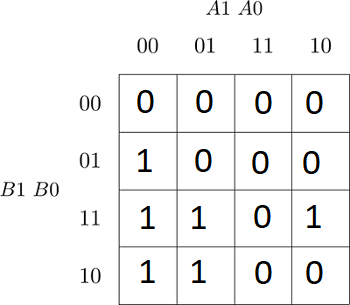
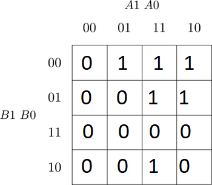

# Lab 2: David Strouhal

0. Complete the truth table for 2-bit *Identity comparator* (B equals A), and two *Magnitude comparators* (B is greater than A, B is less than A). Note that, such a digital device has four inputs and three outputs/functions.

   | **Dec. equivalent** | **B[1:0]** | **A[1:0]** | **B is greater than A** | **B equals A** | **B is less than A** |
   | :-: | :-: | :-: | :-: | :-: | :-: |
   |  0 | 0 0 | 0 0 | 0 | 1 | 0 |
   |  1 | 0 0 | 0 1 | 0 | 0 | 1 |
   |  2 | 0 0 | 1 0 | 0 | 0 | 1 |
   |  3 | 0 0 | 1 1 | 0 | 0 | 1 |
   |  4 | 0 1 | 0 0 | 1 | 0 | 0 |
   |  5 | 0 1 | 0 1 | 0 | 1 | 0 |
   |  6 | 0 1 | 1 0 | 0 | 0 | 1 |
   |  7 | 0 1 | 1 1 | 0 | 0 | 1 |
   |  8 | 1 0 | 0 0 | 1 | 0 | 0 |
   |  9 | 1 0 | 0 1 | 1 | 0 | 0 |
   | 10 | 1 0 | 1 0 | 0 | 1 | 0 |
   | 11 | 1 0 | 1 1 | 0 | 0 | 1 |
   | 12 | 1 1 | 0 0 | 1 | 0 | 0 |
   | 13 | 1 1 | 0 1 | 1 | 0 | 0 |
   | 14 | 1 1 | 1 0 | 1 | 0 | 0 |
   | 15 | 1 1 | 1 1 | 0 | 1 | 0 |

<a name="part0"></a>

### 2-bit comparator

1. Karnaugh maps for other two functions:

   Greater than:

   

   Less than:

   

2. Equations of simplified SoP (Sum of the Products) form of the "greater than" function and simplified PoS (Product of the Sums) form of the "less than" function.

   

   \begin{align*}
   greater_{min}^{SoP} =&~ (B_{1}\cdot \overline{A_{1}})+(B_{0}\cdot \overline{A_{0}}\cdot \overline{A_{1}})+(B_{0}\cdot{B_{1}}\cdot \overline{A_{0}})\\
   less_{min}^{PoS} =&~ (\overline{B_{0}}+ {A_{1}})\cdot(\overline{B_{1}}+ {A_{0}})\cdot(B_{1}+{A_{0}}+{A_{1}})\cdot(B_{0}\cdot\overline{B_{1}}\cdot \overline{A_{0}})\\
   \end{align*} 

### 4-bit comparator

1. Listing of VHDL stimulus process from testbench file (`testbench.vhd`) with at least one assert (use BCD codes of your student ID digits as input combinations). Always use syntax highlighting, meaningful comments, and follow VHDL guidelines:

   Last two digits of my student ID: xxxx71

```vhdl
    p_stimulus : process
    begin
      -- Report a note at the beginning of stimulus process
      report "Stimulus process for 4-bit binary comparator started" severity note;
		------------------------------------------------------------

        -- Test case for last 2 ID digits --> xxxx71...
        s_d <= "0111"; s_c <= "0001"; wait for 100 ns;
        -- ... and its expected outputs
        assert ((s_D_greater_C = '1') and
                (s_D_equals_C  = '0') and
                (s_D_less_C    = '0'))
        -- If false, then report an error
        -- If true, then do not report anything
        report "Id input combination 0111, 0001 FAILED" severity error; 

        -- Report a note at the end of stimulus process
        report "Stimulus process finished" severity note;
        wait; -- Data generation process is suspended forever
    end process p_stimulus;
```

2. Text console screenshot during your simulation, including reports.

   

3. Link to your public EDA Playground example:

   2bit comparator: [https://www.edaplayground.com/x/CsxM](https://www.edaplayground.com/x/CsxM)

   4bit comparator: [https://www.edaplayground.com/x/TzCa](https://www.edaplayground.com/x/TzCa)

   