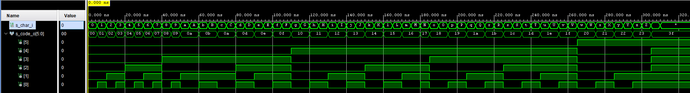

# char_to_code

0. Component in/out:

```vhdl
entity char_to_code is
    Port ( 
        char_i : in  character;
        code_o : out std_logic_vector(6 - 1 downto 0)
    );
end char_to_code;
```

1. Connect keyboard letters to define character

```vhdl
case char_i is
        
                when '0' =>
                    code_o <= "000000"; -- 0
                   
                when '1' =>
                    code_o <= "000001"; -- 1
              ------------------------------
                when 'A' =>
                    code_o <= "001010"; -- A
                
                when 'a' =>
                    code_o <= "001010"; -- a
              ------------------------------
```
2. Simulation




