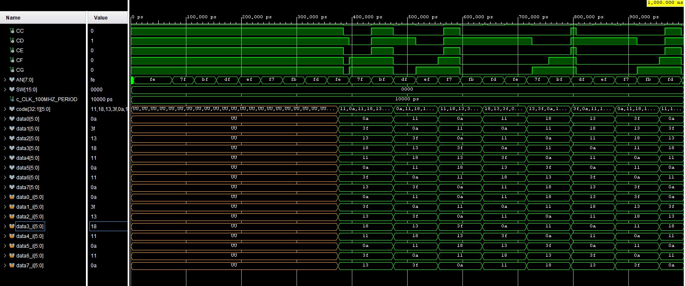

# TOP

0. Component in/out:

```vhdl
entity newtop is
    Port ( CLK100MHZ : in STD_LOGIC;
           CA : out STD_LOGIC;
           CB : out STD_LOGIC;
           CC : out STD_LOGIC;
           CD : out STD_LOGIC;
           CE : out STD_LOGIC;
           CF : out STD_LOGIC;
           CG : out STD_LOGIC;
           AN : out std_logic_vector (7 downto 0);
           BTNC : in std_logic;
           SW : in STD_LOGIC_vector(15 downto 0);
           BTND : in STD_logic
           );
end newtop;
```

1. 


2. Simulation


